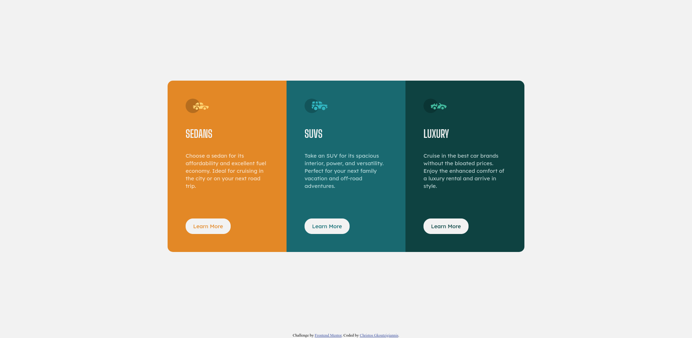
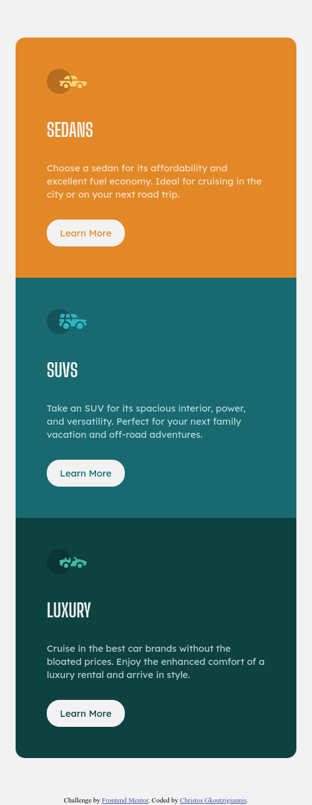

# Frontend Mentor - 3-column preview card component solution

This is a solution to the [3-column preview card component challenge on Frontend Mentor](https://www.frontendmentor.io/challenges/3column-preview-card-component-pH92eAR2-). Frontend Mentor challenges help you improve your coding skills by building realistic projects. 

## Table of contents

- [Overview](#overview)
  - [The challenge](#the-challenge)
  - [Screenshot](#screenshot)
  - [Links](#links)
- [My process](#my-process)
  - [Built with](#built-with)
  - [What I learned](#what-i-learned)
  - [Useful resources](#useful-resources)
- [Author](#author)

## Overview

### The challenge

Users should be able to:

- View the optimal layout depending on their device's screen size.
- See hover states for interactive elements.

### Screenshot

You can see the desktop and mobile layout screenshots here:

### Links

- Solution URL: [https://github.com/cgkoutzigiannis/3-column-creview-card-component](hhttps://github.com/cgkoutzigiannis/3-column-creview-card-component)
- Live Site URL: [https://nostalgic-goldwasser-1237cf.netlify.app/](https://nostalgic-goldwasser-1237cf.netlify.app/)

## My process

### Built with

- Semantic HTML5 markup
- CSS custom properties
- Flexbox
- Mobile-first workflow

### What I learned

The most important things I learned during this challenge are:
- Using Flexbox to create a responsive layout.
- CSS custom properties to reduce code duplication.
- The process of turning a design into code.

### Useful resources

- [A Step-By-Step Process for Turning Designs Into Code](https://css-tricks.com/a-step-by-step-process-for-turning-designs-into-code/) - This article outlines a fantastic process for tackling and analysing a design. It really helped me to think about the design first, instead of just diving into the code.
- [A Complete Guide to Flexbox](https://css-tricks.com/snippets/css/a-guide-to-flexbox/) - The most complete guide to Flexbox, that I use a lot as a reference.
- [MDN CSS Reference](https://developer.mozilla.org/en-US/docs/Web/CSS/Reference) - The MDN CSS Reference is a must everytime I start a project with CSS.

## Author

- Frontend Mentor - [@chrisgoutzi](https://www.frontendmentor.io/profile/chrisgoutzi)
